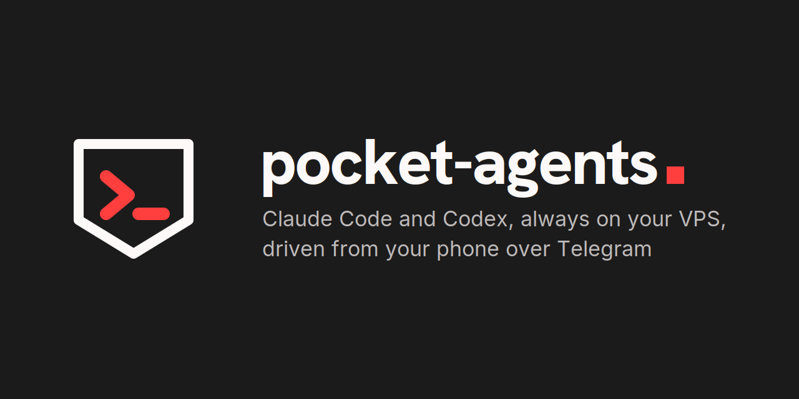

<p align="center"></p>

<p align="center"><em><a href="README.md">English</a> · Español</em></p>

**pocket-agents** convierte un VPS en la casa de tus agentes de código: una sesión
persistente de Claude Code por proyecto, siempre encendida, que consultas y diriges desde
el móvil — con el ordenador apagado.

- 🧠 **Una sesión por proyecto**, supervisada por systemd, que retoma donde lo dejó
- 📱 **Un bot de Telegram** para ver el estado, hacer login, añadir, pausar o cerrar sesiones
- 🔑 **Login por Telegram**: el bot te manda el enlace y tú le devuelves el código
- 🩺 **Un vigilante** que reconecta las sesiones caídas y avisa antes de que caduque un login
- 🧹 **Mantenimiento de disco y puertos**: barrido de Docker, avisos de puertos expuestos, trabajo sin subir
- 🌐 **Previews por HTTPS opcionales** de tus servidores de desarrollo, con un túnel de Cloudflare
- 🤖 **Codex opcional**, el agente de OpenAI, con su propia unidad

👉 **[Mira cómo encaja todo](https://pepebits.github.io/pocket-agents/overview.html)** — un recorrido visual de una página, con diagramas.

## 🚀 Puesta en marcha

Necesitas un VPS con **Ubuntu 24.04 o 26.04** recién instalado al que entres como `root` con tu clave SSH y al
menos 20 GB de disco. Con 8 GB de RAM caben unas cuatro sesiones cómodas.

**1. 📥 Clona este repo** en tu ordenador.

```bash
git clone https://github.com/Pepebits/pocket-agents.git
cd pocket-agents
```

**2. ⚙️ Crea tu configuración.** Todas las líneas son opcionales; la plantilla explica cada una.

```bash
cp config.env.example config.env
```

**3. 🔒 Fase 1, como root** — crea el usuario `dev`, el cortafuegos, el swap y Docker.

```bash
cat config.env setup.sh | ssh root@<IP> 'bash -s'
```

**4. 🧰 Fase 2, como dev** — toolchains, Claude Code y las herramientas de pocket-agents.

```bash
cat config.env setup.sh | ssh dev@<IP> 'bash -s'
```

Las dos fases se pueden relanzar sin miedo: se saltan lo que ya está hecho.

**5. 🔑 Inicia sesión en el servidor.** Estos dos te piden pegar un código.

```bash
ssh dev@<IP>
gh auth login
claude auth login
```

**6. 📂 Elige tus proyectos.** Cada uno que elijas se convierte en una sesión en la app de Claude.

```bash
claude-repos pick
```

`claude-repos list` enseña lo que hay montado, `claude-repos add gitlab:grupo/repo` añade
uno por nombre, y `tmux -L claude-<proyecto> attach -t claude-<proyecto>` te mete en la
terminal de una sesión.

**7. 🤖 Conecta Telegram.** Crea un bot con [@BotFather](https://t.me/BotFather), consigue
tu id numérico de usuario (por ejemplo con [@userinfobot](https://t.me/userinfobot)) y,
en el servidor:

```bash
install -d -m700 ~/.config/claude-rc-telegram
cat > ~/.config/claude-rc-telegram/config <<'EOF'
TG_TOKEN=<el token que te da @BotFather>
TG_CHAT=<tu id numérico de usuario>
EOF
chmod 600 ~/.config/claude-rc-telegram/config

systemctl --user enable --now claude-rc-bot              # el bot
claude-rc-bot --setup                                    # una vez: su menú y descripción
systemctl --user enable --now claude-rc-watchdog.timer   # el vigilante
```

✅ **Listo.** Abre tu bot en Telegram y envía `/status`.

**Extras opcionales:**

- 🌐 **Previews** — abre un servidor de desarrollo del puerto 3000 en
  `https://p3000-dev.<tu-zona>`: ejecuta `cloudflared tunnel login` y luego
  `cloudflare/tunnel-setup.sh`, que te pregunta la zona de Cloudflare si no está en
  `config.env`. Ponle Cloudflare Access delante: esas URLs son públicas mientras el
  servidor esté levantado.
- 🤖 **Codex** — pon `CODEX=1` en `config.env` antes de la fase 2. Su login necesita
  antes dos ajustes en ChatGPT; ver [notas de diseño → Codex](docs/design.es.md#el-otro-agente-codex).

## 📱 Desde el móvil

| Comando | Qué hace |
|---|---|
| `/status` | 🟢 Todas las sesiones de un vistazo, con botones para login, pausar o reanudar |
| `/login <sesión>` | 🔑 Te manda el enlace de login; respóndele con el código |
| `/new` | ➕ Clona un repo, crea uno privado o abre una sesión vacía |
| `/close <sesión>` | ➖ Para una sesión, conservando o borrando su carpeta |
| `/ports` | 🔌 Qué escucha y qué queda expuesto a internet |
| `/backup` | 💾 Trabajo que solo existe en este disco, con un botón para subirlo |
| `/disk` | 🧹 Qué llena el disco, con botones para liberarlo |
| `/reboot` | 🔄 Qué interrumpiría ahora mismo un reinicio |
| `/update` | ⬆️ Versiones nuevas de Claude Code o Codex, y qué sesiones van con una vieja |
| `/codex` | 🤖 Servicio, app-server y login de Codex |

`/nueva` y `/cerrar` valen como alias. El bot habla inglés o español: las unidades traen
`CLAUDE_RC_LANG=es`; ponlo a `en` para inglés.

## 🛠️ Qué hay en el servidor

| Herramienta | Función |
|---|---|
| `claude@<proyecto>` | 🧠 Un servicio de systemd por sesión, que retoma con `--continue` |
| `claude-rc-bot` | 📱 El bot de Telegram |
| `claude-login-bridge` | 🔑 Lleva el `/login` interactivo por Telegram |
| `claude-rc-watchdog` | 🩺 Enlaces caídos, logins que caducan, reinicios pendientes, puertos expuestos |
| `claude-rc-status` | 📋 El estado real de cada sesión |
| `claude-session` | ▶️ Arranca una sesión con la confianza del workspace ya sembrada |
| `claude-repos` | 📂 Elige repos de GitHub y GitLab y los convierte en sesiones |
| `claude-docker-gc` | 🧹 Barrido diario de Docker, que activa la fase 2 |

## ⚙️ Configuración

`config.env` va delante de `setup.sh` porque el script llega por `bash -s`: no puede
preguntarte nada, y ssh no lleva tus variables locales al servidor.

| Variable | Por defecto | Para |
|---|---|---|
| `REPOS` | vacío | Proyectos a montar en la fase 2, p. ej. `"miorg/api gitlab:equipo/web"` |
| `NODE_V` / `GO_V` / `PY_V` | `24` / `1.23` / `3.12` | Versiones de runtime; `NODE_V=lts` sigue la LTS vigente |
| `CODEX` | `0` | `1` instala Codex y su unidad |
| `SELF_REPO` | este repo | De dónde clona la fase 2 las herramientas, si usas un fork |
| `ZONE` | se pregunta | Zona de Cloudflare para las previews |
| `LABEL` / `TUNNEL` / `PORTS` | `dev` / `dev-vps` / puertos de desarrollo habituales | Nombres de host y puertos de las previews |

🔄 **Actualizar** las herramientas tras un `git pull` en el servidor:

```bash
install -m755 bin/claude-* ~/.local/bin/
install -m644 systemd/*.service systemd/*.timer ~/.config/systemd/user/
install -Dm644 share/i18n.json ~/.local/share/claude-rc/i18n.json
systemctl --user daemon-reload     # el bot se recarga solo; las unidades necesitan esto
```

## 📚 Para saber más

- 🗺️ **[Recorrido visual](https://pepebits.github.io/pocket-agents/overview.html)** — topología, supervisión, el flujo de login
- 🧭 **[Notas de diseño](docs/design.es.md)** — por qué cada pieza funciona así, y los fallos que hay detrás
- 📒 **[Runbook](docs/runbook.md)** — el día a día (en inglés)
- 🔧 **[Troubleshooting](docs/troubleshooting.md)** — fallos ya diagnosticados (en inglés)

## 🧪 Tests

```bash
./tests/run          # herméticos: un Telegram y un HOME de mentira
./tests/run --live   # además diagnósticos que leen el estado de esta máquina
```

Sin dependencias más allá de python3 y `git`. Ver [tests/README.md](tests/README.md).

## 🧷 Principios

- 🐳 **Sin contenedores para los agentes** — montarles el socket de Docker les daría root igualmente
- 🏝️ **Separado de producción** — este servidor no sirve nada público
- 👤 **Todo en user-space** — nada de `sudo npm -g`
- 🔀 **Git es el punto de encuentro** entre el servidor y tu portátil
- 🛑 **Nada en el allowlist que ejecute código arbitrario** — esas órdenes preguntan, y respondes desde el móvil

El razonamiento de cada uno está en las [notas de diseño](docs/design.es.md#principios).

## 📄 Licencia

[MIT](LICENSE) © Pepebits
